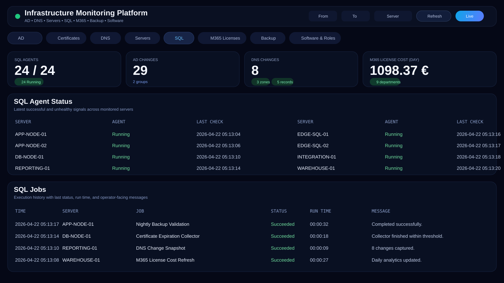
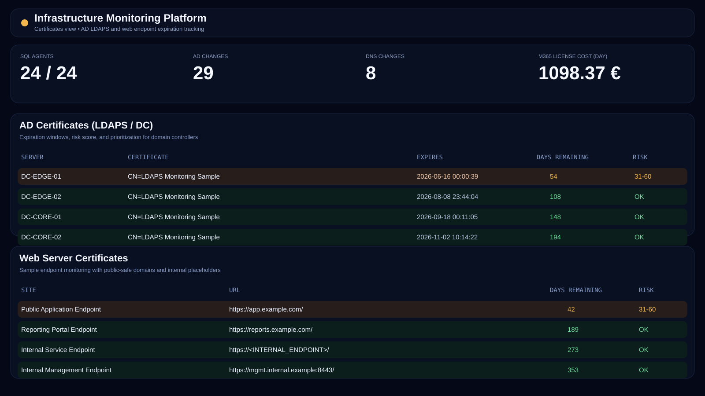
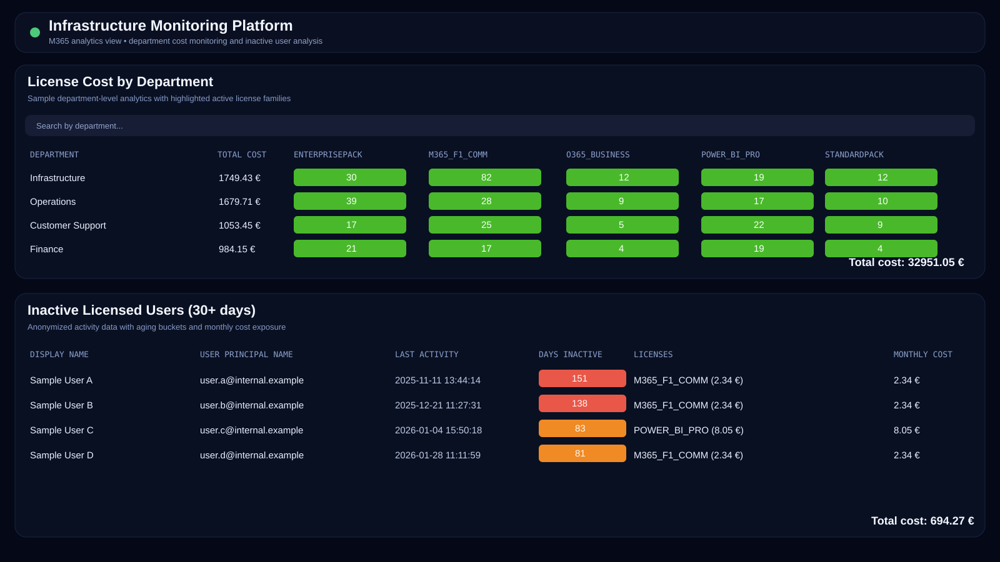
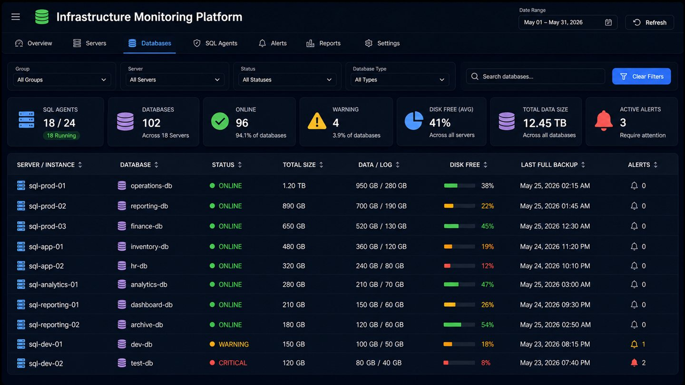
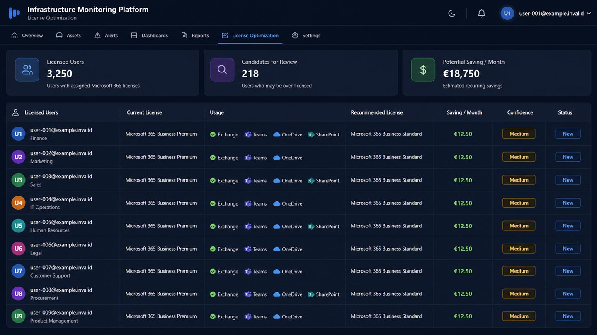
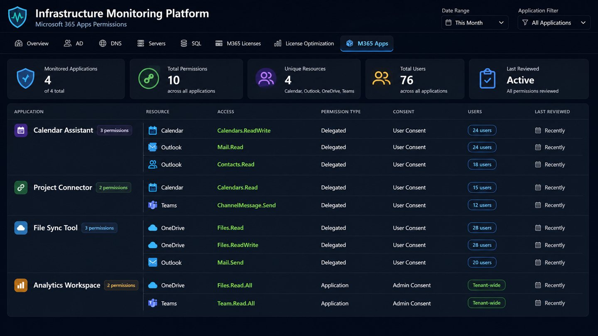
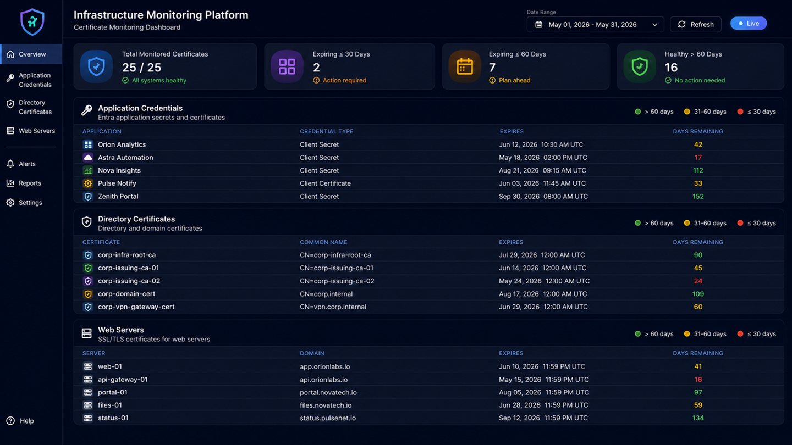

# Infrastructure Monitoring Platform

## Project Summary

Custom-built enterprise monitoring platform designed to centralize infrastructure visibility, automate health checks, and improve proactive issue detection across distributed environments.

This project combines PowerShell collectors, SQL Server storage, scheduled automation, and reporting workflows into a single monitoring solution covering infrastructure, identity, security, Microsoft 365, certificates, and backup validation.


All screenshots and examples in this repository are anonymized. They contain no production hostnames, IP addresses, domains, tenant data, user identities, or credentials.

## Why This Project Matters

This repository demonstrates:

- end-to-end monitoring design
- practical PowerShell automation at enterprise scale
- SQL-backed analytics and reporting structure
- cross-domain monitoring across AD, DNS, servers, Microsoft 365, and backups
- business-focused operational engineering

## Key Highlights

- built a modular PowerShell-based monitoring platform
- centralized infrastructure telemetry into SQL Server
- designed fact and dimension style storage for analytics-ready reporting
- automated recurring checks through Task Scheduler
- covered both operational and security monitoring scenarios
- created a scalable foundation for future collectors and dashboard expansion

## Monitoring Scope

### Active Directory

- user and group changes
- insecure LDAP authentication events
- AD and LDAPS certificate expiration
- Group Policy change tracking

### DNS

- DNS zone changes
- DNS record changes

### Server Health

- reboot tracking
- firewall status
- installed software inventory

### Microsoft 365

- inactive users
- license cost analytics by department

### Backup Validation

- cloud storage backup checks

### Web and TLS

- web server certificate validation


### SQL Server and Database Monitoring

- SQL Agent availability and backup job status
- database status, size, data/log allocation, recovery model, compatibility level, and last full backup
- file-level volumes, free space, autogrowth, and data/log details
- low-space, offline database, failed collection, and backup-related signals
- historical tracking of data and log growth
- instance and database filters organized by anonymized environment categories, such as regional application, data warehouse, and business-service workloads

### Microsoft 365 Governance and License Optimization

- inactive-user reporting with account creation date and service-account exclusion lists
- license allocation and cost analysis by department
- 180-day activity assessment across Exchange, Teams, OneDrive, SharePoint, and desktop activity
- license downgrade or removal recommendations with estimated monthly savings and confidence level
- inventory of third-party enterprise applications with delegated and tenant-wide permissions
- grouped review of application, resource, permission scope, consent type, and affected users
- filtering of Microsoft first-party and approved internal applications to focus reviews on external risk
- Entra application secret and certificate expiry monitoring

## Architecture

```text
PowerShell Collectors
        ↓
SQL Server Monitoring Database
        ↓
Dashboard / Reporting Layer
```

## Interface Preview
















## Core Design

The platform is built around a modular collector model:

- PowerShell scripts collect infrastructure and service data
- data is written into a centralized SQL Server database
- fact and dimension tables provide analytics-ready structure
- Task Scheduler jobs ensure automated and continuous execution
- reporting and dashboard layers enable historical analysis and visibility

## Technology Stack

- PowerShell
- SQL Server
- Windows Server
- Active Directory
- Microsoft Graph API
- Task Scheduler
- Cloud storage REST APIs
- .NET / web dashboard layer

## Capabilities

- centralized infrastructure visibility
- proactive issue detection
- historical analytics
- security event monitoring
- license and cost reporting
- backup validation
- automation-first operations

## Example Operational Scenarios

- detect expiring AD and LDAPS certificates before service impact
- identify insecure LDAP usage in domain environments
- track DNS changes for audit and troubleshooting
- monitor server reboot causes and patterns
- analyze Microsoft 365 license allocation and cost by department
- validate SQL backup presence in cloud storage buckets


- monitor SQL Server databases for growth, available disk capacity, backup freshness, and collection errors
- review third-party Microsoft 365 application access to mail, calendars, files, Teams, SharePoint, and other Graph resources
- identify underused Microsoft 365 licenses and evaluate recommended license changes before assignment updates
- renew Entra application credentials before service impact

## Business Value

- reduced manual monitoring effort
- improved incident response time
- better operational visibility
- stronger security and compliance awareness
- scalable foundation for future monitoring expansion

## My Role

Designed and implemented the monitoring architecture, PowerShell collector approach, SQL-backed data model, and automation workflows for centralized infrastructure monitoring and analytics.

## Repository Structure

```text
/PowerShell
/SQL
/Dashboard
/Docs
README.md
```

### PowerShell Layout

- `PowerShell/active-directory` for AD change tracking, certificate checks, LDAP event collection, and Group Policy monitoring
- `PowerShell/dns` for DNS change collection
- `PowerShell/server-health` for firewall, reboot, and software inventory monitoring
- `PowerShell/microsoft365` for inactive user reporting and license cost analytics
- `PowerShell/backup` for cloud backup validation workflows
- `PowerShell/web` for web and TLS certificate checks
- `PowerShell/utilities` for helper and diagnostic automation

### SQL Layout

- `SQL/schema` for table creation scripts
- `SQL/migrations` for schema evolution and data model adjustments
- `SQL/permissions` for collector access and least-privilege setup
- `SQL/queries` for operational validation queries
- `SQL/maintenance` for cleanup and lifecycle tasks

### Dashboard Layout

- `Dashboard/InfrastructureMonitoringDashboard` for the sanitized .NET dashboard source, API layer, and static frontend assets

## Project Status

Actively developed and extended with new collectors, SQL migrations, and reporting improvements.

## Role Alignment

This project is a strong fit for profiles focused on:

- Infrastructure Engineering
- Systems Engineering
- PowerShell Automation
- Microsoft 365 Administration
- Platform Operations
- Monitoring and Observability

## GitHub About

```text
Custom infrastructure monitoring platform built with PowerShell, SQL Server, and automation for AD, DNS, certificates, M365, backups, and server health.
```

## Suggested GitHub Topics

```text
powershell, sql-server, monitoring, infrastructure, active-directory, dns, microsoft365, automation, windows-server
```

## Author

Denys Hrytsai  
Infrastructure / Systems Engineer  
Azure • Microsoft 365 • PowerShell • SQL Server • Automation
