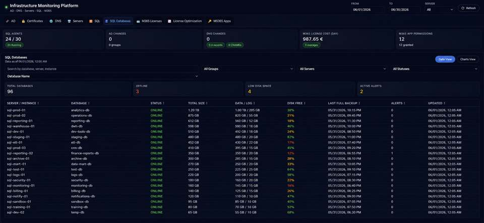
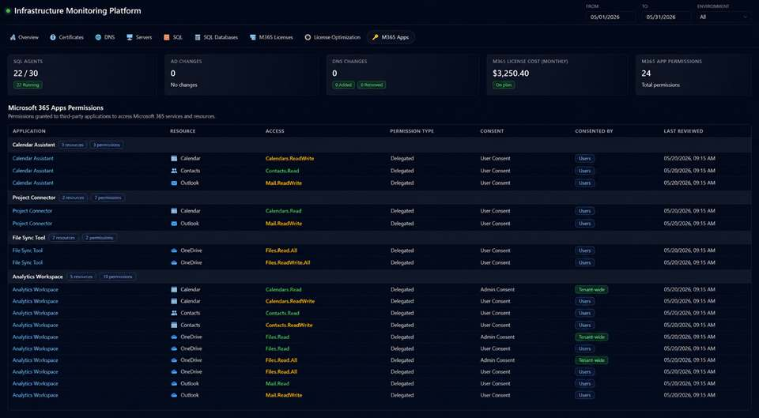
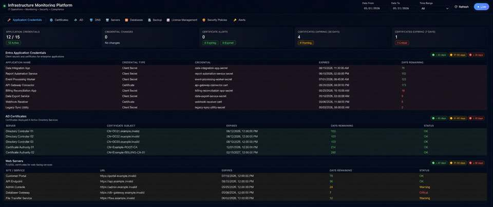

# Infrastructure Monitoring Platform

A PowerShell, SQL Server, and .NET monitoring platform for centralized infrastructure operations. It collects operational and security telemetry from Windows, Active Directory, DNS, SQL Server, Microsoft 365, web endpoints, and cloud backup storage, then presents the results in a single dashboard.

All screenshots and examples in this repository are anonymized. They contain no production hostnames, IP addresses, domains, tenant data, user identities, or credentials.

## What It Solves

- Gives infrastructure teams one place to review service health, changes, risk signals, and historical trends.
- Replaces repetitive manual checks across SQL Server, Microsoft 365, certificates, directory services, DNS, and backup storage.
- Detects common issues before they become incidents: expiring credentials, insufficient disk space, missing backups, unused or oversized licenses, failed SQL Agent jobs, and unexpected configuration changes.
- Keeps collection modular: new checks can be introduced as PowerShell collectors without redesigning the portal.

## Architecture

```text
PowerShell collectors + Microsoft Graph API + SQL Server system views
                              |
                              v
                    Central SQL Server Monitoring DB
                     fact / dimension-oriented schema
                              |
                              v
                   .NET API and responsive web dashboard
```

Collectors run through Windows Task Scheduler and use least-privilege SQL logins where possible. The dashboard exposes current state, filters, alerts, drill-downs, and historical data.

## Monitoring Modules

### SQL Server and Databases

- SQL Agent availability and backup job status.
- Grouped SQL instance inventory with filters for `1C RU`, `1C UA`, `DWH`, and `Kontakt` environments.
- Database status, size, data/log allocation, recovery model, compatibility level, and last full backup.
- File-level volume, free-space, autogrowth, and data/log details.
- Low-space, offline database, failed collection, and backup-related signals.
- Database-size history showing data and log growth over time.



### Microsoft 365 License Analytics and Optimization

- License allocation and monthly cost analysis by department.
- Inactive-user reporting with creation date and exclusion lists for service accounts.
- 180-day activity assessment across Exchange, Teams, OneDrive, SharePoint, and desktop activity.
- Recommendations for license downgrade or removal, with estimated monthly savings and confidence level.
- License catalog and price management for the supported Microsoft 365 products.


### Microsoft 365 Application Governance

- Inventory of third-party enterprise applications with delegated and tenant-wide permissions.
- Grouped view of application, resource, permission scope, consent type, and affected users.
- Resource-aware presentation for Outlook, Calendar, Contacts, OneDrive, SharePoint, Teams, and other Microsoft Graph services.
- Filtering of Microsoft first-party and approved internal applications to focus reviews on external risk.
- Monitoring of Entra application secrets and certificates, including expiry and expired credentials.



### Certificate Monitoring

- Entra application secret and certificate expiry.
- AD and LDAPS certificate status on directory controllers.
- TLS certificate checks for internal and external web services.
- Visual risk levels for expiring and expired credentials.



### Directory, DNS, Server, and Backup Monitoring

- Active Directory user and group changes.
- Group Policy change tracking and insecure LDAP authentication events.
- DNS zone and record change tracking.
- Server reboot history, firewall status, and installed software inventory.
- Cloud-storage backup validation.

## Core Technology

- PowerShell
- SQL Server
- .NET web API and frontend
- Microsoft Graph PowerShell SDK
- Windows Server, Active Directory, DNS, IIS
- Windows Task Scheduler
- Cloud storage REST APIs

## Repository Layout

```text
/PowerShell          # Collectors and operational scripts
/SQL                 # Schema, migrations, permissions, and queries
/Dashboard            # Sanitized .NET API and dashboard source
/Docs/assets          # Anonymized documentation screenshots
README.md
```

## Operational Model

1. A collector connects to its source system using scoped credentials.
2. It normalizes the result and stores it in the central SQL Server monitoring database.
3. The dashboard reads the latest state and historical snapshots through its .NET API.
4. Operators filter, investigate alerts, and open per-resource detail views.

## Example Use Cases

- Find a database whose data volume is growing unexpectedly or whose disk has limited free capacity.
- Identify a SQL Server instance with a failed SQL Agent backup job.
- Review third-party applications that have `Files.ReadWrite.All`, mail, calendar, Teams, or SharePoint access.
- Renew an Entra application secret or TLS certificate before expiration.
- Review inactive or underused Microsoft 365 licenses and estimate the potential saving before changing assignments.
- Audit directory, DNS, Group Policy, and reboot activity during an incident investigation.

## Project Status

Actively developed. The platform continues to grow through additional collectors, SQL migrations, dashboard improvements, and automation hardening.

## Author

Denys Hrytsai  
Infrastructure / Systems Engineer  
Azure, Microsoft 365, PowerShell, SQL Server, Automation

